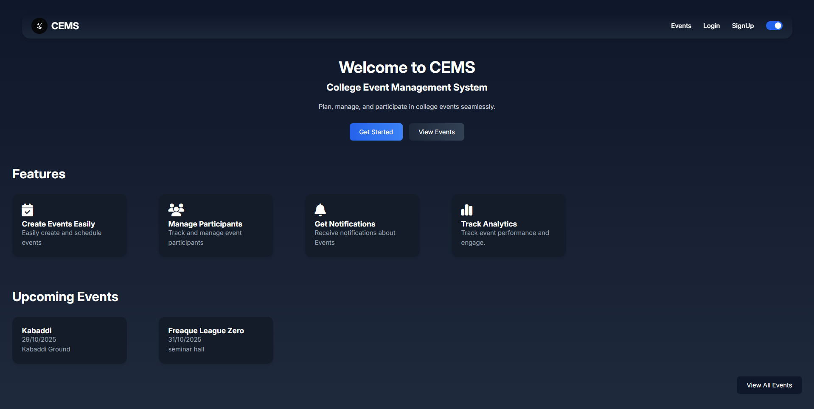
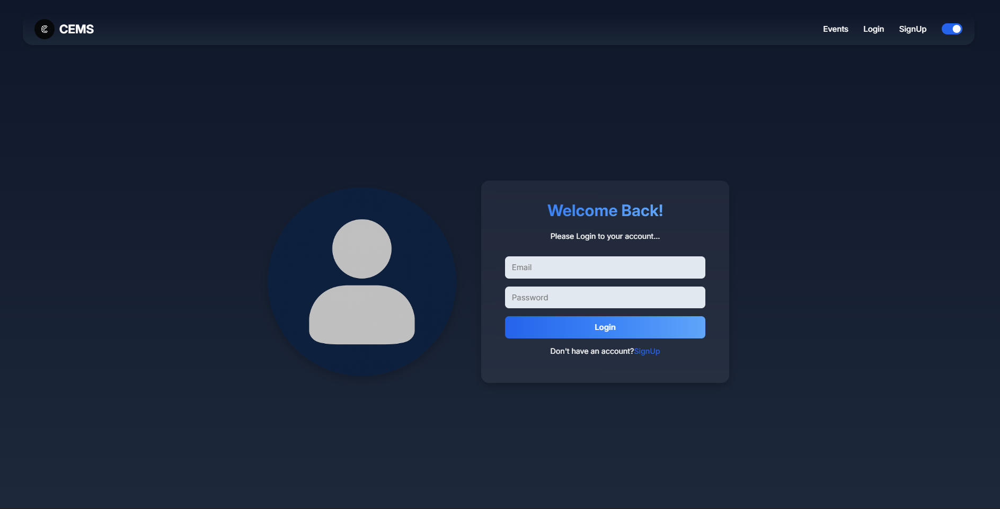
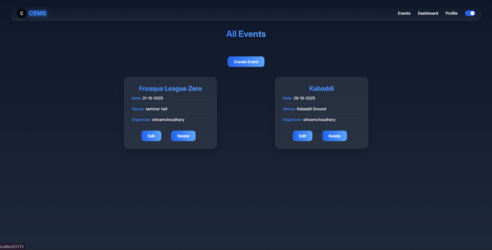
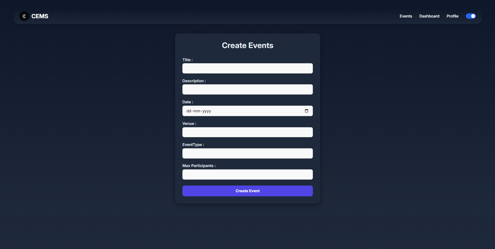
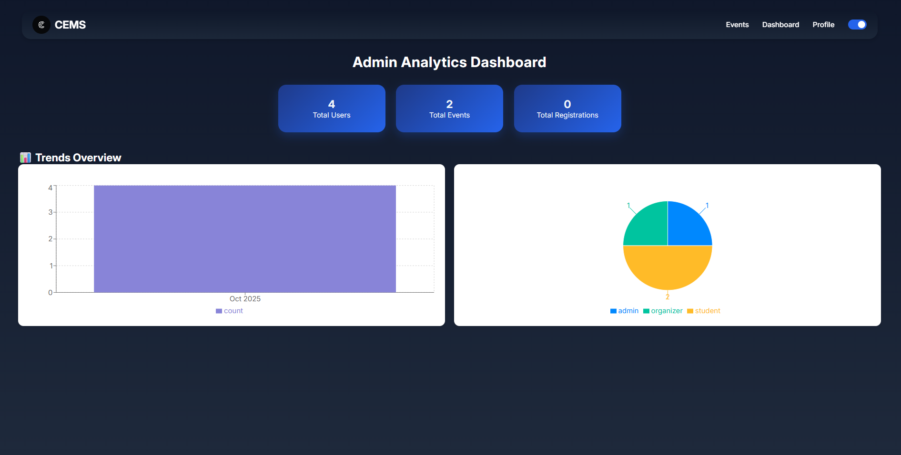

# 🎓 Campus Event Management System (CEMS)

A full-stack web application designed to manage campus events efficiently with **role-based access**, **real-time updates**, and **data analytics**.  
Built with **MERN Stack (MongoDB, Express.js, React, Node.js)**.

---

## 🚀 Features

- 🔐 **Authentication & Authorization**
  - JWT + HTTP-only Cookies for secure sessions
  - Role-based access (Admin, Organizer, Student)

- 🧩 **Event Management**
  - Full CRUD operations on events
  - Organizers can manage their own events
  - Admins can manage all events

- 📊 **Admin Dashboard**
  - Monthly analytics chart for events
  - User role distribution chart
  - Stats persist even if events are deleted

- ⚙️ **Real-Time Functionality**
  - Live event updates using Socket.IO
  - Auto refresh of event list for all users

- 🧾 **Email Notifications**
  - Confirmation email when an event is created

- 🌗 **UI & UX**
  - Dark / Light mode toggle
  - Responsive design using CSS Modules
  - Toast notifications & skeleton loaders

---

## 🧰 Tech Stack

| Layer | Technology |
|:--|:--|
| **Frontend** | React.js, Axios, Recharts, CSS Modules, Vite |
| **Backend** | Node.js, Express.js, Socket.IO, Joi Validation |
| **Database** | MongoDB (Mongoose ODM) |
| **Email Service** | Nodemailer |
| **Authentication** | JWT + Bcrypt.js |
| **Deployment** | Vercel (Frontend), Render (Backend), MongoDB Atlas |

---

## 📸 Screenshots

| Description | Screenshot |
|:--|:--|
| Landing Page |  |
| Login / Signup |  |
| Events Page |  |
| Create Event |  |
| Admin Dashboard |  |

*(Replace with your actual screenshot paths)*

---

## ⚙️ Environment Variables

Create a `.env` file in your **Backend** folder and add:

```env
PORT=3000
MONGODB_URI=your_mongodb_connection_string
ACCESS_TOKEN_SECRET=your_access_secret
REFRESH_TOKEN_SECRET=your_refresh_secret
FRONTEND_URL=https://your-frontend.vercel.app
EMAIL_USER=your_email@example.com
EMAIL_PASS=your_email_app_password
🧪 Run Locally

🖥 Backend Setup
cd Backend
npm install
npm run dev

💻 Frontend Setup
cd Frontend
npm install
npm run dev

Frontend runs on http://localhost:5173
Backend runs on http://localhost:3000

📦 API Overview
🔑 Auth Routes
POST   /api/v1/users/register
POST   /api/v1/users/login
POST   /api/v1/users/logout

📅 Event Routes
GET    /api/v1/events
POST   /api/v1/events
PUT    /api/v1/events/:id
DELETE /api/v1/events/:id

🧠 Admin Routes
GET    /api/v1/admin/stats
GET    /api/v1/admin/users
GET    /api/v1/admin/events
GET    /api/v1/admin/registrations

🌍 Deployment
🔹 Frontend (Vercel)
Build your frontend:
npm run build
Push to GitHub and connect your repo to Vercel

Add your VITE_API_BASE_URL in Vercel environment settings.

🔹 Backend (Render)
Push backend to a separate GitHub repo.

Deploy to Render

Add all environment variables in Render’s dashboard.

Update CORS settings:
js
Copy code
app.use(cors({
  origin: process.env.FRONTEND_URL,
  credentials: true,
}));

🔹 Database (MongoDB Atlas)
Create a cluster on MongoDB Atlas

Whitelist all IPs or your current IP.

Copy connection string and paste into your .env.

📊 Data Persistence for Charts
Admin dashboard charts are powered by a separate EventStats model:

Tracks total events created per month and year.
Stats remain even if events are deleted.

const eventStatsSchema = new mongoose.Schema({
  month: { type: String, required: true },
  year: { type: Number, required: true },
  count: { type: Number, default: 0 },
});
When a new event is created, the corresponding month’s count is incremented.

🧑‍💻 Author
Your Name — Shivam
📧 shivamch0865@gmail.com
🔗 https://www.linkedin.com/in/shivam-choudhary-28a019346/?skipRedirect=true
💻 https://github.com/Shivamch0

⭐ Acknowledgements
React Documentation
Express.js Guide
MongoDB Atlas
Render Deployment
Vercel Hosting